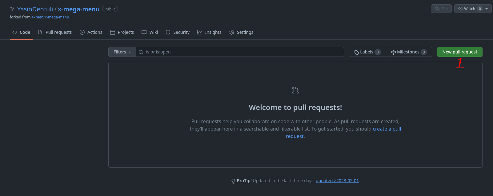

# Pull Shark

## Como obter a conquista Pull Shark no GitHub passo a passo:

### 1.Você precisa fazer Fork um repositório (você pode fazer Fork de qualquer repositório que desejar).

### 2. Quando seu repositório em fork é criado, você precisa fazer algumas alterações nele (quaisquer alterações, como adicionar um novo arquivo ou fazer modificações no código). Depois disso, você precisa ir até a aba (pull requests);

### 3. Clique no botão “New pull request”;

### 4. Agora você verá um texto verde indicando que pode mesclar seu pull request. Portanto, clique no botão “Create pull request” para criar seu pull request com sucesso. Você terá então que esperar que o criador do repositório aceite sua solicitação.
#### - Você precisa de 2 pull requests mesclados/aceitos para obter a conquista Pull Shark.

### 5. Pronto! Agora você pode ver a conquista Pull Shark em sua lista de conquistas.

