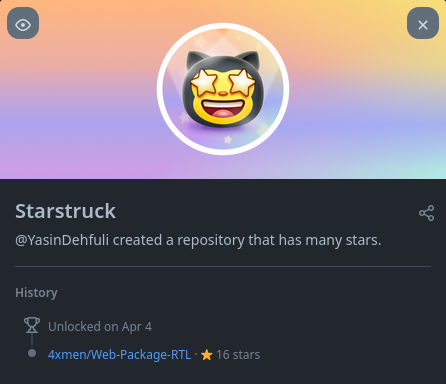

# Звездный

## Как получить достижение Starstruck GitHub шаг за шагом:

### 1. Вам нужно всего 16 звезд для каждого проекта, зарегистрированного на ваше имя пользователя. Получать от других пользователей вашей организации или репозитория.

### 2. Готово. Теперь вы можете увидеть достижение Starstruck в списке достижений.

