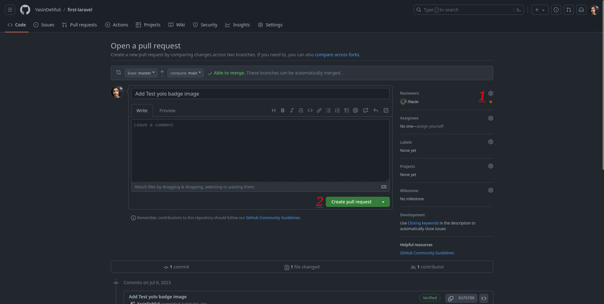
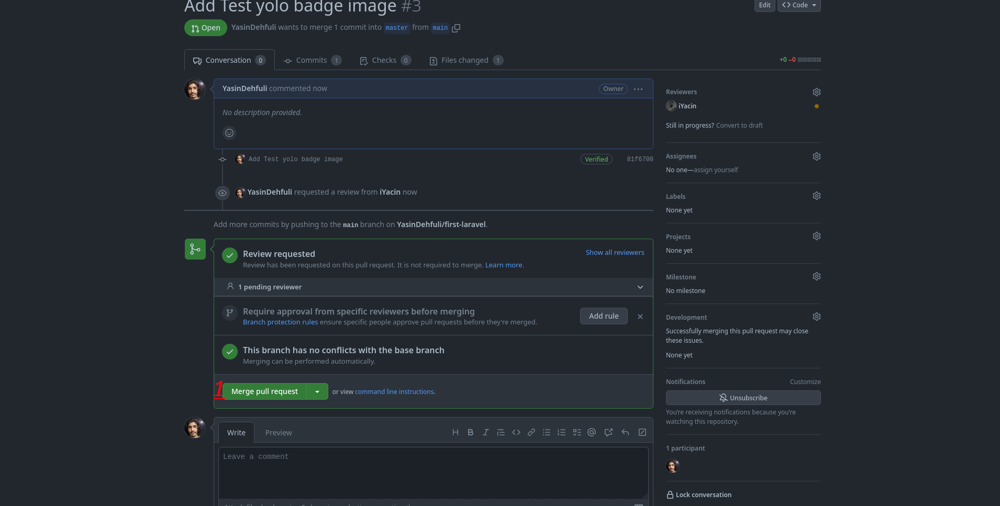

# Yolo

## Как получить достижение Yolo GitHub шаг за шагом:

### 1. Во-первых, вам нужно открыть репозиторий и перейти к настройкам.

### 2. Во-вторых, вам нужно перейти в категорию соавторов и в этом разделе пригласить учетную запись, у которой есть доступ к репозиторию.

### 3. В-третьих, вам нужно добавить новую ветку в ваш репозиторий.

### 4. Теперь вам нужно добавить файл в новую созданную вами ветку.

### 5. Добавьте файл и зафиксируйте описание для него и, наконец, зафиксируйте свои изменения.

### 6. Нажмите на зеленую кнопку, сравните и вытяните запрос.

### 7. Добавьте приглашенного на шаге 2 в качестве рецензента и создайте запрос на вытягивание.

### 8. Наконец, проверьте, что ваш рецензент, а затем нажмите «Объединить запрос на вытягивание».

### 9. Готово, теперь вы можете увидеть это достижение Yolo в списке своих достижений.

