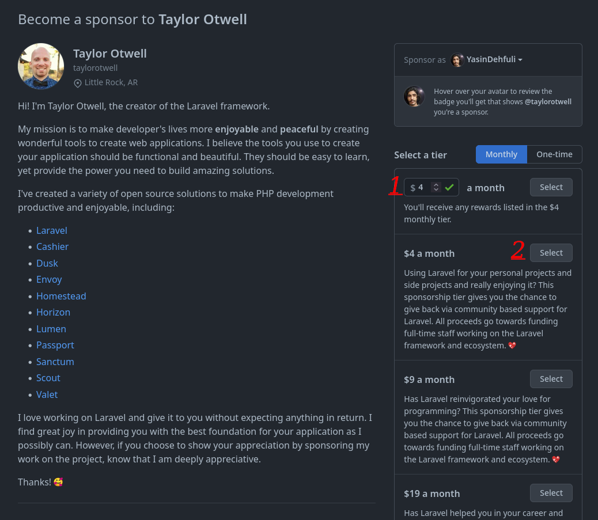

# Public Sponsor

## Adım adım Public Sponsor GitHub başarısı nasıl elde edilir:

### 1. (Öncelikle bilmeniz gereken, bu rozeti almak ve biraz para bağışlamak için kredi kartına ihtiyacınız var). Ardından önce GitHub Sponsorlar sayfasını açmanız ve ardından En iyi bağımlılıklarınızı görün düğmesine tıklamanız gerekir

### 2. Bağış yapabileceğiniz geliştiricilerin bir listesini burada görebilirsiniz (sayfalarında sponsorlu bir düğme bulunan herhangi bir GitHub kullanıcısına sponsor olabilirsiniz).

### 3. Sponsor olacak bir kişi bulduktan sonra, aylık ne kadar bağış yapmak istediğinizi seçebileceğiniz bir sayfa görebilirsiniz.

### 4. Burada ödeme yapmak için bir form var, ödemeniz yapıldıktan sonra. Rozetinizi profilinizde görebilirsiniz (Beta sürümünde şimdilik 30 ülkede ödeme yöntemleri var).

#### 5. Bitti, artık bu Public Sponsor Başarımını başarımlar listenizde görebilirsiniz.

