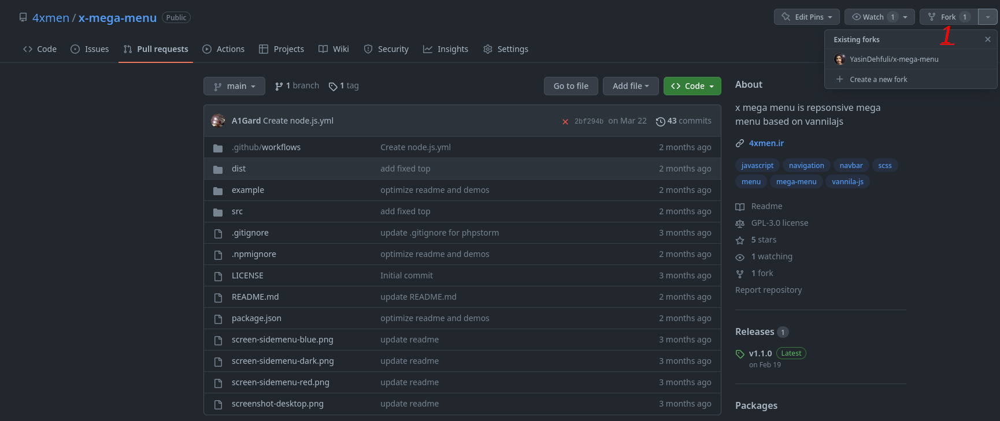
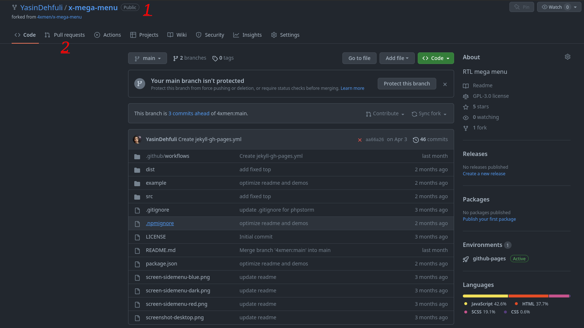
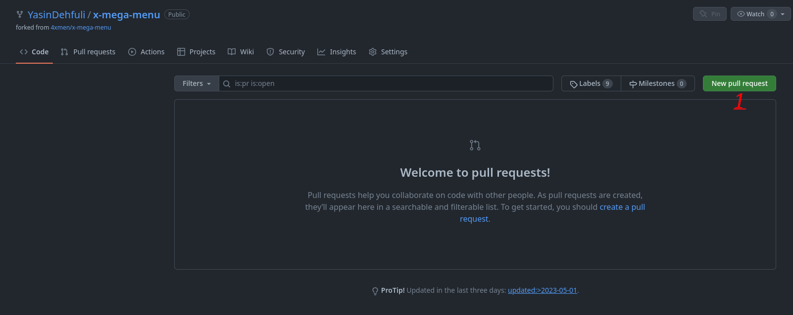
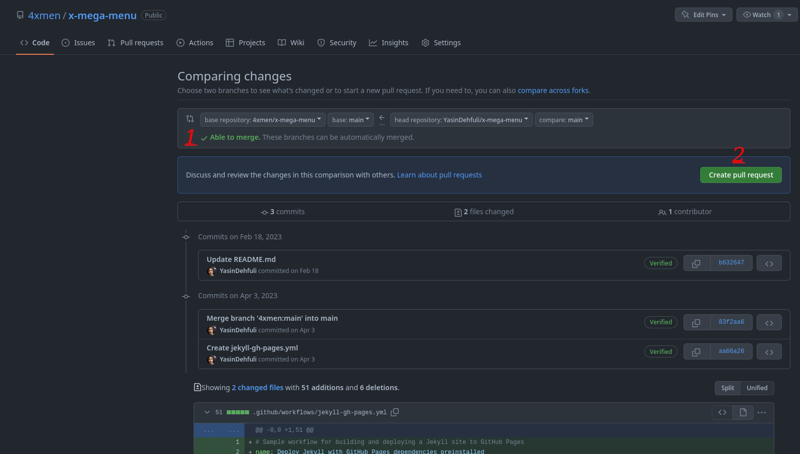
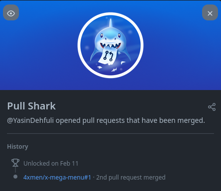

# Pull Shark

## Pull Shark GitHub başarısı adım adım nasıl elde edilir:

### 1. Bir repository'den fork almanız gerekir (herhangi bir repository'yi forklayabilirsiniz).  

### 2. Forklanan repo'nuz oluşturulduğunda, forklanan repo üzerinde bazı değişiklikler yapmanız gerekir (yeni dosya eklemek veya kodlarda bazı değişiklikler yapmak gibi herhangi bir değişiklik!), Bundan sonra, pull request sekmesine gitmeniz gerekir;

### 3. Pull Request Oluştur butonuna tıklayın;

### 4. Şimdi yeşil metni birleştirebileceğinizi görebilirsiniz, bu da çekme isteğinizi birleştirebileceğiniz anlamına gelir, bu nedenle çekme isteğinizi başarıyla oluşturmak için Çekme İsteği Oluştur düğmesine tıklayın. Ardından, isteğinizin deponun yaratıcısı tarafından birleştirilmesini beklemeniz gerekir.
#### - Pull Shark başarımını elde etmek için 2 birleştirilmiş çekme isteğine ihtiyacınız var.

### 5. Bitti, şimdi bu Pull Shark Başarısını Başarılar listenizde görebilirsiniz.

