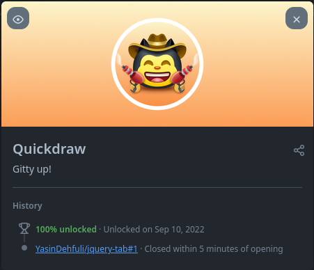

# Quickdraw

## Quickdraw GitHub başarısı adım adım nasıl elde edilir:

### 1. Herhangi bir depoda yeni bir issue veya pull request oluşturmanız gerekir.

### 2. Şimdi bir başlık yazmalı ve bir yorum bırakmalısınız (eğer isterseniz) . ve sonra . Submit New Issue butonuna tıklayın.

### 3. İstediğiniz yorumu yazın ("Issue" ya da "Pull Request "i yorum yapmadan da kapatabilirsiniz) ve ardından Close Issue / Close Pull Request butonuna tıklayın. 

### 4. Bitti, şimdi bu Quickdraw Başarısını Başarılar listenizde görebilirsiniz.

