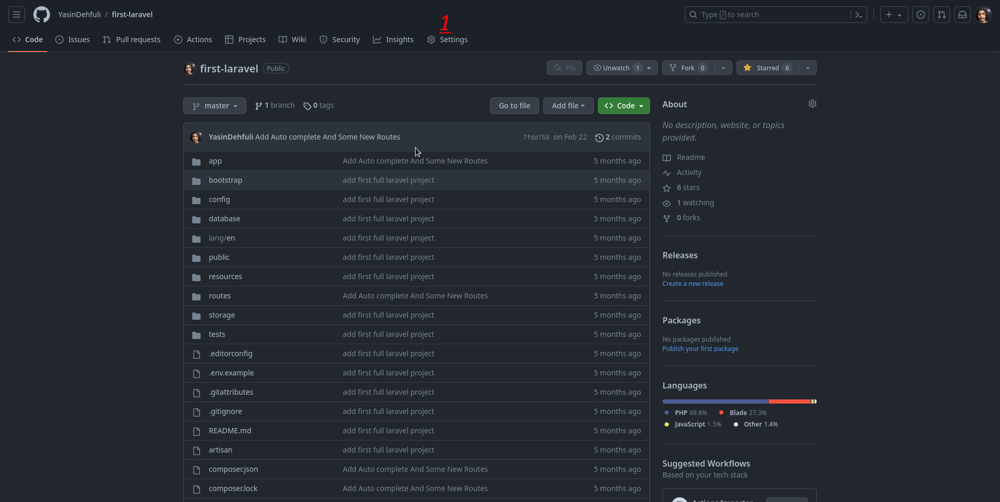
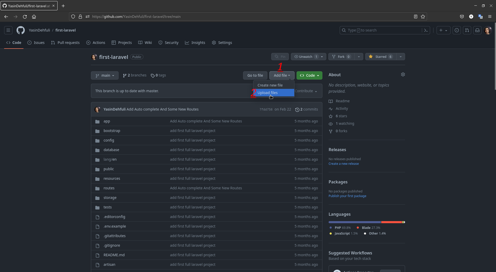

# Yolo

## Yolo GitHub başarısı adım adım nasıl elde edilir :

### 1. İlk olarak, repoyu açmanız ve ayarlara gitmeniz gerekir.

### 2. İkinci olarak, collaborators kategorisine gitmeniz ve bu bölümde, repository'ye erişiminiz olan bir hesabı davet etmeniz gerekir.

### 3. Üçüncü olarak, repository'nize yeni bir branch eklemeniz gerekir.

### 4. Şimdi, oluşturduğunuz yeni branch'e bir dosya eklemeniz gerekiyor.

### 5. Dosyayı ekleyin ve bunun için açıklamayı commit edin ve son olarak değişikliklerinizi commit edin

### 6. Yeşil düğmeye tıklayın, compare ve pull request yapın.

### 7. Adım-2'de davet edilen kişiyi Reviewer olarak ekleyin ve pull request oluşturun.

### 8. Son olarak, Reviewer'ınızı kontrol edin ve ardından Merge pull request'e tıklayın.

### 9. Bitti , Şimdi Yolo Başarısını başarılar listenizde görebilirsiniz.

