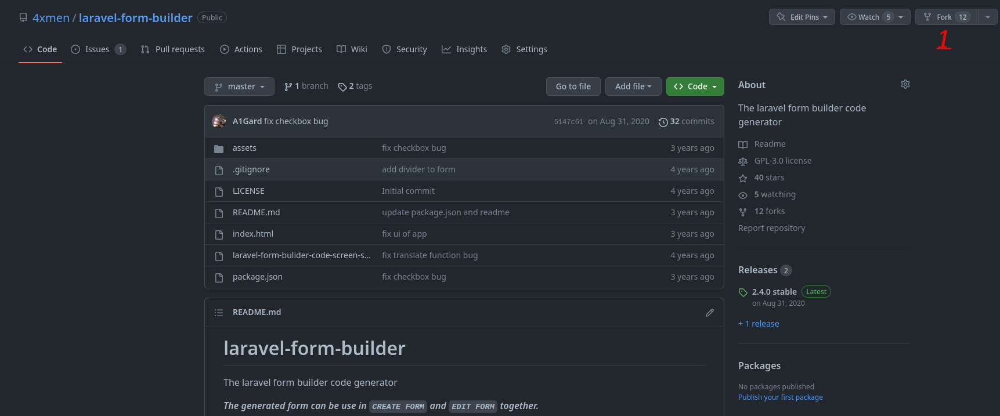
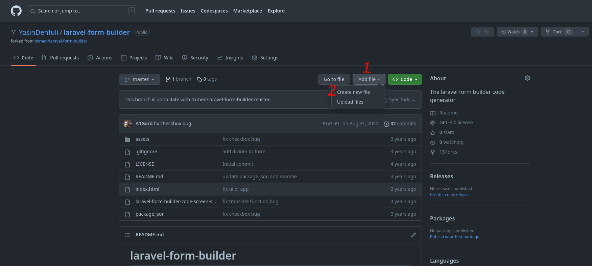
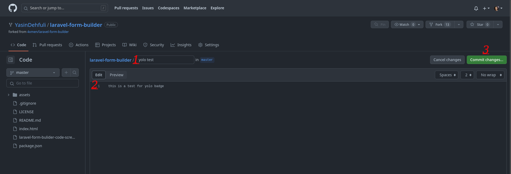
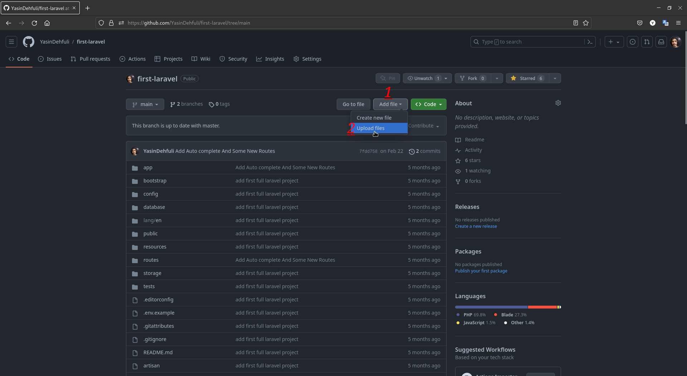
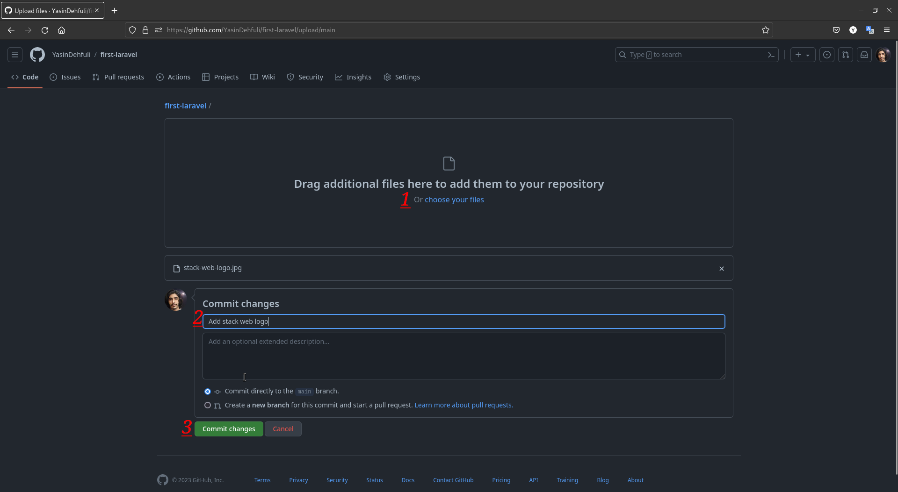
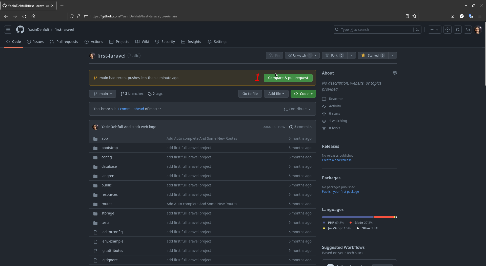
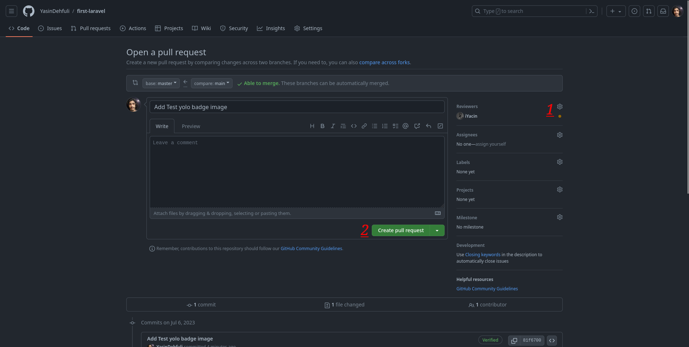
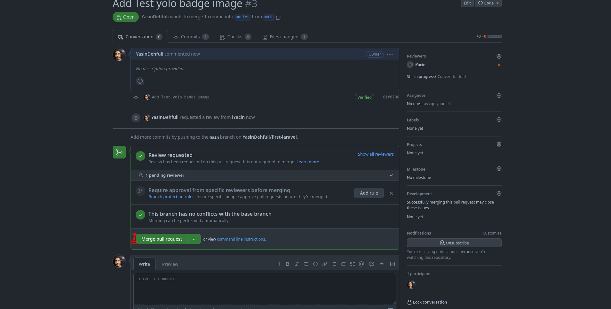

# Yolo

## How to get Yolo GitHub achievement step by step :

### 1. First you need to fork from a repository , click fork then click on Create fork button get a fork of a repository

### 2. Add a file edit some texts or do some changes on forked repository

### 3. Commit your added file or edited text in forked repository . 

### 4. Create a new branch for this commit and start a pull request

### 5. Click , Compare and pull request button

### 6. Add a Reviewer To you committed changes on forked repository

### 7. Add Any comment you want in the box then click on Create pull request . When your Pull Request added - Merge it before the Reviewer and Click on Merge Pull Request button  .   

### 8. Done . Now you can see that Yolo Achievement is now added to your received achievements list.

